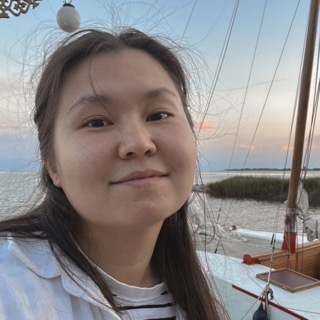

# __AINURA ODINTSEVA__



***

## JUNIOR FRONTEND DEVELOPER

***

## __CONTACTS__

* __Address:__ Bishkek, Kyrgizstan
* __Email:__ ain.odintseva@gmail.com
* __Telegram:__ [ain_odin](https://t.me/ain_odin)
* __LinkedIn:__ [Ainura Odintseva](https://www.linkedin.com/in/ainura-odintseva-884697258/)
* __Github:__ [ain-odin](https://github.com/ain-odin)
* __Discord:__ [ain-odin#3094](https://discordapp.com/users/1049171384909189130)

***

## __EDUCATION__

* __Bachelor Degree__
---
Kyrgyz State University of Construction, Transport and Architecture | 2017 - 2022

* __Graphic design courses__
---
AirBee | 2018

* [__Responsive Web Design__](https://www.freecodecamp.org/)
---
Freecodecamp | nov. 2022

* [__JavaScript / HTML / CSS__](https://code-basics.com/ru)
---
Code-basics courses | 2023

* [__JavaScript/Front-end. Stage 0__](https://rs.school/js-stage0/)
---
Rolling Scopes School | dec. 2022 - mar. 2023
 
* [__JavaScript/Front-end__](https://rs.school/js/#basic-knowledge)
---
Rolling Scopes School | in progress

***

## WORK EXPERIENCE

* __Vanilla Coffee Company__
---
Head barista | 2014 - 2020

* __Production center__
---
Grafic designer | 2020 - 2022

* __Breez__
---
Frontend intern | nowadays

## __SKILLS__

* HTML, CSS/SCSS
* JavaScript (Basic)
* Git (GitHub, GitLab)
* VS Code
* Adobe Photoshop, Illustrator, InDesign
* Brewing delicious coffee

***

## __LANGUAGES__

* __Kyrgyz__ - Native
* __Russian__ - Native
* __English__ - Upper-Intermediate

***

## __CODE__

Solution of [__Bit Counting__](https://www.codewars.com/kata/526571aae218b8ee490006f4) kata from _Codewars_
```
var countBits = function(n) {
  return n.toString(2).split('0').join('').length;
};
```

***

## __Projects__

* [__CV__](https://ain-odin.github.io/rsschool-cv-stage0/) project from previous _JavaScript/Front-end_ stage by RS School

* [__Plants__](https://rolling-scopes-school.github.io/ain-odin-JSFEPRESCHOOL2022Q4/plants/) project from previous _JavaScript/Front-end_ stage by RS School

***

## __SUMMARY__

I am an enthusiastic, self-motivated, reliable, responsible and hard working person. Motherhood additionally strengthened my qualities such as patience, multitasking, attention to detail. I am a mature team worker and adaptable to all challenging situations. I am able to work well both in a team environment as well as using own initiative. I am able to work well under pressure and adhere to strict deadlines.

My goal is to learn a pure JavaScript at a good level and learn the React library. I would like to work under the guidance of an experienced developer to gain practical experience.